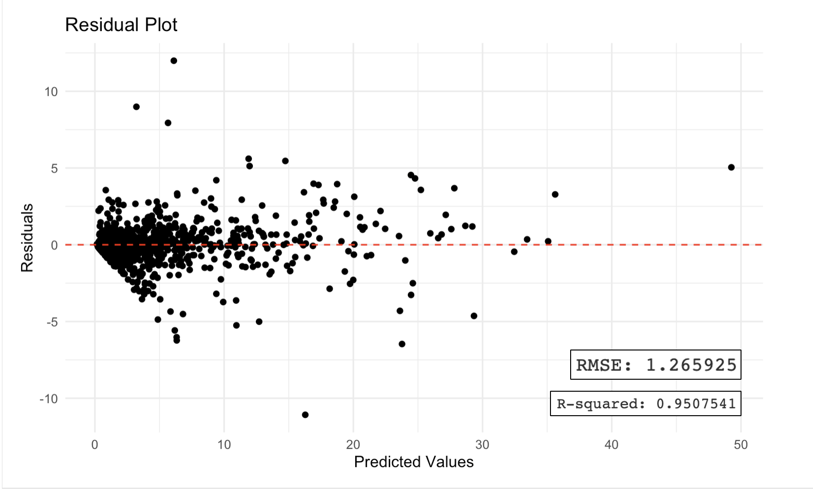
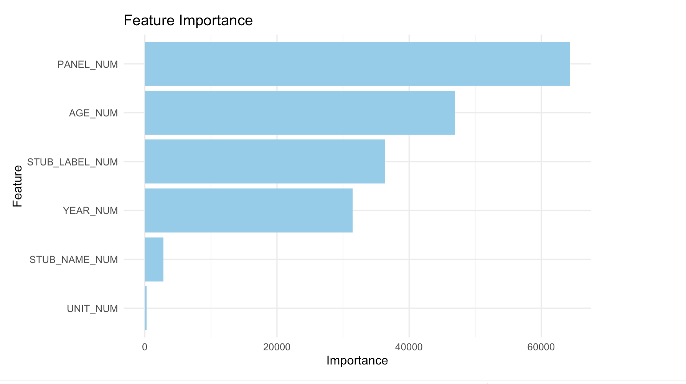

```{r setup, include=FALSE}
knitr::opts_chunk$set(echo = FALSE)
knitr::opts_chunk$set(cache = TRUE)
library(flexdashboard)
library(readr)
library(tidyverse)
library(dplyr)
library(ggplot2)
library(shiny)
library(highcharter)
```

```{r}
knitr::opts_chunk$set(cache = TRUE)

thm <- 
  hc_theme(
    colors = c("#1a6ecc", "black", "#90ed7d"),
    chart = list(
      backgroundColor = "transparent",
      style = list(fontFamily = "Helvetica")
    ),
    xAxis = list(
      gridLineWidth = 1
    )
  )

data_og = read.csv("Drug_overdose_death_rates__by_drug_type__sex__age__race__and_Hispanic_origin__United_States_20240518.csv")

data_crude = data_og %>%
# Using the "Deaths per 100,000 resident population, crude" rates instead of the age-adjusted rates to look at the age distributions.
  filter(UNIT == "Deaths per 100,000 resident population, crude")

data_adjusted = data_og %>%
# Using the "Deaths per 100,000 resident population, age-adjusted" rates instead of the crude rates (ensuring that differences from one year to another, are not due to differences in the age distribution of the populations from year to year.
  filter(UNIT == "Deaths per 100,000 resident population, age-adjusted")


### Data for age
health_data_og = read.csv("Drug_overdose_death_rates__by_drug_type__sex__age__race__and_Hispanic_origin__United_States_20240518.csv")

### Cleans up the data set
health_data = data_og %>%
  na.omit() %>%
  select(-INDICATOR, -UNIT, -STUB_NAME, -FLAG) 

### indexes_all_age = grep("All ages", health_data$AGE)

indexes_all_age = which(health_data$AGE == "All ages")

n = length(health_data$AGE)

for(i in 1:n) {
  if(i %in% indexes_all_age) {health_data$AGE[i] = NA}
}

health_data_age = health_data %>%
  na.omit()


### Filtered data 2 
### Cleans up the data set
health_data = data_og %>%
  na.omit() %>%
  select(-INDICATOR, -UNIT, -STUB_NAME, -FLAG)

### Sex
index_vector = c(1:n)

indexes_male = grep("Male", health_data$STUB_LABEL)
indexes_female = grep("Female", health_data$STUB_LABEL)
indexes_wo_sex = setdiff(index_vector, union(indexes_female, indexes_male))


for(i in 1:n) {
  health_data$SEX[i] = ifelse(i %in% indexes_wo_sex, NA,
                           ifelse(i %in% indexes_male, "Male",
                                  ifelse(i %in% indexes_female, "Female", NA)))
}

### Race
indexes_white = grep("White", health_data$STUB_LABEL)
indexes_black = grep("Black", health_data$STUB_LABEL)
indexes_asian = grep("Asian", health_data$STUB_LABEL)
indexes_hs_lat = grep("All races", health_data$STUB_LABEL)
indexes_native = grep("American Indian or Alaska Native", health_data$STUB_LABEL)
indexes_island = grep("Islander", health_data$STUB_LABEL)

for(i in 1:n) {
  health_data$RACE[i] = ifelse(i %in% indexes_white, "White",
                           ifelse(i %in% indexes_black, "Black",
                                  ifelse(i %in% indexes_asian, "Asian", 
                                         ifelse(i %in% indexes_hs_lat, "Hispanic or Latino",
                                                ifelse(i %in% indexes_native, "Native American",
                                                       ifelse(i %in% indexes_island, "Islander", NA))))))
}

```

Data By Demographic
================================

Questions to Explore: {.sidebar}
-------------------------------------

1. What are the trends in drug overdose death rates over time?

```{r}
# Creating the user inputs on the sidebar (year slider and panel dropdown)
sliderInput("year0", label = "Year:",
            min = 1999, max = 2018, value = c(1999,2018), step = 1, ticks=F, sep="")
selectInput("layer", label = "Deaths By:",
            choices = c("Total Overdoses", "Any Opioid", "Natural and Semisynthetic Opioids", "Methadone", "Synthetic Opioids (other than methadone)", "Heroin"), selected = "Total Overdoses")
```

Row {.tabset}
-------------------------------------

### Drug Overdose By Age and Sex $^a$

```{r, cache=FALSE}
renderPlot({ 
  if (input$layer == "Total Overdoses") {
    panel_selection = data_crude %>%
    filter(PANEL == "All drug overdose deaths")
  } else if (input$layer == "Any Opioid") {
    panel_selection = data_crude %>%
    filter(PANEL == "Drug overdose deaths involving any opioid")
  } else if (input$layer == "Natural and Semisynthetic Opioids") {
    panel_selection = data_crude %>%
    filter(PANEL == "Drug overdose deaths involving natural and semisynthetic opioids")
  } else if (input$layer == "Methadone") {
    panel_selection = data_crude %>%
    filter(PANEL == "Drug overdose deaths involving methadone")
  } else if (input$layer == "Synthetic Opioids (other than methadone)") {
    panel_selection = data_crude %>%
    filter(PANEL == "Drug overdose deaths involving other synthetic opioids (other than methadone)")
  } else if (input$layer == "Heroin") {
    panel_selection = data_crude %>%
    filter(PANEL == "Drug overdose deaths involving heroin")}
  
  data_1 = panel_selection %>%
  # Replace NA's with 0
  filter(YEAR <= input$year0[2]) %>%
  filter(YEAR >= input$year0[1]) %>%
  mutate(EST = ifelse(is.na(ESTIMATE), 0, ESTIMATE)) %>%
  group_by(STUB_LABEL_NUM, STUB_LABEL, PANEL_NUM) %>%
  summarise(EST = sum(EST))
  
ggplot(data_1, aes(x=reorder(STUB_LABEL, EST), y = EST)) + 
  geom_bar(stat = "identity")+
  coord_flip() +
  ylab("Estimate (Deaths Per 100,000 summed over the years selected)")+
  xlab("Age and Sex Group")
})

```

### Drug Overdose Over Time By Age $^a$ 

```{r, cache=FALSE}
renderPlot({ 
  if (input$layer == "Total Overdoses") {
    panel_selection = data_crude %>%
    filter(PANEL == "All drug overdose deaths")
  } else if (input$layer == "Any Opioid") {
    panel_selection = data_crude %>%
    filter(PANEL == "Drug overdose deaths involving any opioid")
  } else if (input$layer == "Natural and Semisynthetic Opioids") {
    panel_selection = data_crude %>%
    filter(PANEL == "Drug overdose deaths involving natural and semisynthetic opioids")
  } else if (input$layer == "Methadone") {
    panel_selection = data_crude %>%
    filter(PANEL == "Drug overdose deaths involving methadone")
  } else if (input$layer == "Synthetic Opioids (other than methadone)") {
    panel_selection = data_crude %>%
    filter(PANEL == "Drug overdose deaths involving other synthetic opioids (other than methadone)")
  } else if (input$layer == "Heroin") {
    panel_selection = data_crude %>%
    filter(PANEL == "Drug overdose deaths involving heroin")}
data_2 = panel_selection %>%
  # Filter year ranges here:
  filter(YEAR <= input$year0[2]) %>%
  filter(YEAR >= input$year0[1]) %>%
  filter(STUB_NAME == "Age") %>%
  # Replace NA's with 0
  mutate(EST = ifelse(is.na(ESTIMATE), 0, ESTIMATE)) %>%
  group_by(AGE, YEAR) %>%
  summarise(EST = sum(EST))

ggplot(data_2, aes(x=YEAR, y = AGE, fill = EST))+
  geom_tile(color = "white")+
  scale_fill_gradient(low = "lightblue", high = "darkred") +
  ylab("Age Group")+
  xlab("Year")+
  labs(fill = "Estimate \n (Deaths Per 100,000)")
})
```

### By Race $^b$

```{r, cache=FALSE}
renderPlot({ 
  if (input$layer == "Total Overdoses") {
    panel_selection = health_data %>%
    filter(PANEL == "All drug overdose deaths")
  } else if (input$layer == "Any Opioid") {
    panel_selection = health_data %>%
    filter(PANEL == "Drug overdose deaths involving any opioid")
  } else if (input$layer == "Natural and Semisynthetic Opioids") {
    panel_selection = health_data %>%
    filter(PANEL == "Drug overdose deaths involving natural and semisynthetic opioids")
  } else if (input$layer == "Methadone") {
    panel_selection = health_data %>%
    filter(PANEL == "Drug overdose deaths involving methadone")
  } else if (input$layer == "Synthetic Opioids (other than methadone)") {
    panel_selection = health_data %>%
    filter(PANEL == "Drug overdose deaths involving other synthetic opioids (other than methadone)")
  } else if (input$layer == "Heroin") {
    panel_selection = health_data %>%
    filter(PANEL == "Drug overdose deaths involving heroin")}
  
  data_3 = panel_selection %>%
    filter(YEAR <= input$year0[2]) %>%
    filter(YEAR >= input$year0[1]) %>%
    na.omit %>%
    group_by(RACE, PANEL_NUM) %>%
    summarise(ESTIMATE = sum(ESTIMATE))
  
ggplot(data_3, aes(x=reorder(RACE, ESTIMATE), y = ESTIMATE)) + 
  geom_bar(stat = "identity") +
  coord_flip()+
  ylab("Estimate (Deaths Per 100,000)")+
  xlab("Race")
})
```

### By Age $^b$

```{r, cache=FALSE}
renderPlot({ 
  if (input$layer == "Total Overdoses") {
    panel_selection = health_data_age %>%
    filter(PANEL == "All drug overdose deaths")
  } else if (input$layer == "Any Opioid") {
    panel_selection = health_data_age %>%
    filter(PANEL == "Drug overdose deaths involving any opioid")
  } else if (input$layer == "Natural and Semisynthetic Opioids") {
    panel_selection = health_data_age %>%
    filter(PANEL == "Drug overdose deaths involving natural and semisynthetic opioids")
  } else if (input$layer == "Methadone") {
    panel_selection = health_data_age %>%
    filter(PANEL == "Drug overdose deaths involving methadone")
  } else if (input$layer == "Synthetic Opioids (other than methadone)") {
    panel_selection = health_data_age %>%
    filter(PANEL == "Drug overdose deaths involving other synthetic opioids (other than methadone)")
  } else if (input$layer == "Heroin") {
    panel_selection = health_data_age %>%
    filter(PANEL == "Drug overdose deaths involving heroin")}
  
  data_4 = panel_selection %>%
    filter(YEAR <= input$year0[2]) %>%
    filter(YEAR >= input$year0[1]) %>%
    group_by(AGE, PANEL_NUM) %>%
    summarise(ESTIMATE = sum(ESTIMATE))
  
ggplot(data_4, aes(x=reorder(AGE, ESTIMATE), y = ESTIMATE)) + 
  geom_bar(stat = "identity") +
  coord_flip()+
  ylab("Estimate (Deaths Per 100,000)")+
  xlab("Age Group")
})

```

### By Gender $^b$

```{r, cache=FALSE}
renderPlot({ 
  if (input$layer == "Total Overdoses") {
    panel_selection = health_data %>%
    filter(PANEL == "All drug overdose deaths")
  } else if (input$layer == "Any Opioid") {
    panel_selection = health_data %>%
    filter(PANEL == "Drug overdose deaths involving any opioid")
  } else if (input$layer == "Natural and Semisynthetic Opioids") {
    panel_selection = health_data %>%
    filter(PANEL == "Drug overdose deaths involving natural and semisynthetic opioids")
  } else if (input$layer == "Methadone") {
    panel_selection = health_data %>%
    filter(PANEL == "Drug overdose deaths involving methadone")
  } else if (input$layer == "Synthetic Opioids (other than methadone)") {
    panel_selection = health_data %>%
    filter(PANEL == "Drug overdose deaths involving other synthetic opioids (other than methadone)")
  } else if (input$layer == "Heroin") {
    panel_selection = health_data %>%
    filter(PANEL == "Drug overdose deaths involving heroin")}
  
  data_5 = panel_selection %>%
    filter(YEAR <= input$year0[2]) %>%
    filter(YEAR >= input$year0[1]) %>%
    na.omit %>%
    group_by(SEX, PANEL_NUM) %>%
    summarise(ESTIMATE = sum(ESTIMATE))
  
  ggplot(data_5, aes(x=SEX, y = ESTIMATE)) + 
    geom_bar(stat = "identity", width = 0.4) +
    ylab("Estimate (Deaths Per 100,000)") +
    xlab("Sex")
})
```

### By Drug Type $^a$

```{r, cache=FALSE}
renderPlot({ 
  if (input$layer == "Total Overdoses") {
    panel_selection = data_adjusted %>%
    filter(PANEL == "All drug overdose deaths")
  } else if (input$layer == "Any Opioid") {
    panel_selection = data_adjusted %>%
    filter(PANEL == "Drug overdose deaths involving any opioid")
  } else if (input$layer == "Natural and Semisynthetic Opioids") {
    panel_selection = data_adjusted %>%
    filter(PANEL == "Drug overdose deaths involving natural and semisynthetic opioids")
  } else if (input$layer == "Methadone") {
    panel_selection = data_adjusted %>%
    filter(PANEL == "Drug overdose deaths involving methadone")
  } else if (input$layer == "Synthetic Opioids (other than methadone)") {
    panel_selection = data_adjusted %>%
    filter(PANEL == "Drug overdose deaths involving other synthetic opioids (other than methadone)")
  } else if (input$layer == "Heroin") {
    panel_selection = data_adjusted %>%
    filter(PANEL == "Drug overdose deaths involving heroin")}
  
df = panel_selection %>%
    filter(YEAR <= input$year0[2]) %>%
    filter(YEAR >= input$year0[1]) %>%
    # Replace NA's with 0
    mutate(ESTIMATE = ifelse(is.na(ESTIMATE), 0, ESTIMATE))
  
ggplot(df, aes(x=YEAR, y = ESTIMATE)) + 
  geom_bar(stat = "identity", position = "dodge") +
  ggtitle("Overdose Deaths By Drug Type") 
})

```

### Introduction and Methodology: $^{a \ and \ b}$


Our team is particularly interested in exploring patterns and relationships related to drug overdose in the USA. We have presented our findings through this dashboard
where we have included visualization graphs that shows the trends of drug overdose death rates by drug overdose type, sex, age, and race, and how a combination of drug overdose type, sex, and age shows the trend of drug overdose death rates. We also created a machine learning model showing the variables that possibly have higher influence on drug overdose death rates.

Method a:

* NA's were replaced with 0
* Using the "Deaths per 100,000 resident population, age-adjusted" for the "By Drug Type Graph, using crude for all other graphs with methodology a.
* Otherwise the same as the data set given


Method b:

* Reordered the data set
* NA's were ommitted

Analysis
================================

Throughout the analysis of the graphs, we can see that as the year increases more estimated deaths are expected to occur with males taking up a higher proportion of fatalities for gender. Depending on the drug we can also see that different age groups are more susceptible to overdose as seen in our detailed analysis. We also see that overall the white population is the most susceptible to drug overdose.

i.) As apparent from the graph comparing the overdose deaths and age there seems to be some correlation with individuals between the ages of 15 and 54 years of age. However, for individuals under the age of 15, the number drops drastically and stays constant throughout the years. Furthermore, anyone from 65-94 seems to be drastically lower compared to the ages of 15-54. In 1999, it appears that 35-44-year-olds had the highest population of deaths whereas in 2015 the highest death age group was 45-54 ages. Then from 2016 - 2018, the highest deaths are among the 25-34 years.
	
* For any opioid, we can also see that as time goes on there is an increase in the amount of estimated deaths.
  * Natural and synthetic opioids seem to follow this same pattern with fewer people under 15 years dying due to overdose
  * For methadone, the age groups only contain under 15 - 74 years with more groups being added as time goes on starting with 15 - 64 in 1999.
  * Synthetic opioids appear to have a higher ratio of 65-75 year olds succumbing to overdose however as time goes on that ratio increases drastically while adding on the age group of 75 - 94 years of age.
* Heroin overdoses seem to only really contain the age groups of 15-74 ages starting with only 15 - 64 ages.

ii.) From the comparison between genders we can see that as time goes on from 1999 to 2018 males seem to overpower the number of females overdosing however as time moves on there is an exponential increase in the number of women succumbing to a drug-related fatality. The ratio for women from 1999 - 2013 seems to increase with the male ratio however from 2014 - 2018 the ratio of females to males decreased even though the death rates are increasing.

For natural and synthetic opioids the ratio between male and female overdose rates appears to be the closest for the whole of 1999-2018. However, around 1999 the ratio was not too close appearing to rise exponentially as time passed to 2018.
For methadone, the ratio starts close to how it appears in the end with the female death rate ratio appearing to remain constant as time passes. However, in 2011 - 2013 there appears to be a massive spike in the ratio of women succumbing to overdoses from methadone almost equaling that of the male rate.
For synthetic opioids, the ratio follows the same trends as the other drugs as the ratio of males is generally higher than that of females however from 2007 - 2010 the rates appear to be almost identical.
 For heroin the ratio stays pretty similar till about 2010 then the ratios increase drastically getting to almost that of a third of the male rates.

iii.) From the graph covering the comparison of race and estimate of deaths we can see that in the beginning there are little to no Islander deaths from overdose however as time moves on we can see that they eventually do appear. We can also see that the ratio of deaths between the races seems to remain constant with the only thing changing is the number of deaths increasing as time passes. However, it does seem that from 2006 - 2012 the Native American population overtakes the White population in terms of the amount of deaths. 

For all of the drugs, it appears that in 1999 - 2002 there were more overdoses among the Black population with the white population overtaking the rate in 2003 which is the trend followed until the end of the data covered.
The same trend is followed by any opioid overdoses with Islanders being omitted in this data.
For natural and semisynthetic opioids it starts with the white population primarily succumbing to overdose regarding these drugs which remains constant throughout the years. Islanders are also omitted for this drug.
Methadone only contains White, Black, Native, Hispanic, and Asian people starting with only white, black, and Hispanic people however from 2008 - 2015 it appears that there are overdoses among the Asian population as well.
Synthetic opioids in 1999, only started with the white, black, and Hispanic populations being shown succumbing to these drugs via overdose. However, from 2008 - 2009 the Native American population overtakes both the black and Hispanic populations with the Asian population succumbing starting from 2014.
Heroin follows a similar pattern as synthetic opioids however it was not until 2014 that the Native population became the second most deaths from heroin.

iv.) From the heat map we can also discern that the main concentration of overdoses is centralized toward the 25-45 years of age in the later years more centralized around 2018 with the density of deaths clearing up drastically as you move further away from that location.

v.) When combining all drug types, the overdose death rate was shown to increase throughout the years. When focusing on any opioid drugs, we could see that there is also an increase of death rate over the years. As we take a closer look and view the specific opioid types, one could observe a slight increase in death rates for natural and semisynthetic opioids from 1999 to 2011, while for other synthetic opioids, there is a rapid increase in death rates starting from 2015. For methadone, we could see that the death rate reaches its peak in 2009, and it declines later on, and for heroin, there is a rapid increase in death rates starting from 2010. Through these results, it was shown that semisynthetic opioids and  heroin have a larger impact on the increase of overdose death rates over the years.


Machine Learning Model
================================

Row {.tabset}
-----------------------------------------------------------------------
### Model Results

```{r picture2, echo = F, fig.cap = "Residuals For Model", out.width = '100%'}

```
### Feature Importance

```{r picture3, echo = F, fig.cap = "Feature Importance", out.width = '100%'}

```
### Methodology

We use random forests to forecast future drug overdose death rates for each demographic group. After using hyperparameter tuning, we have the improved model with the RMSE equals to 1.26 and marginal of error equal to 0.07. By exploring feature importance in the random forest, we can conclude that drug overdose type and age are most strongly associated with higher death rates.


Data Preprocessing:

* Data Cleaning: Handle missing values, inconsistencies, and delete unnecessary variables in the dataset.

Model Training:

* Ensemble Learning: Random Forest is an ensemble learning method that combines 
multiple decision trees to make predictions.

Model Evaluation:

* Cross-Validation: Perform k-fold cross-validation to assess the model's generalization performance on different subsets of the data.
* Accuracy: Calculate RMSE and marginal of error
Hyperparameter Tuning:
Validation Set: Use cross-validation to evaluate each hyperparameter combination and select the best-performing one.

Model Interpretation:

 * Feature Importance: Assess the importance of features in predicting the target variable using Mean Decrease in Impurity (MDI).
